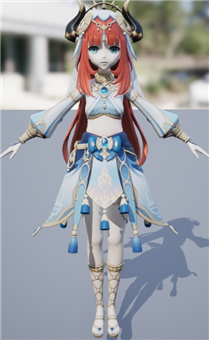
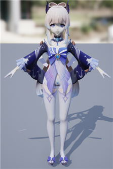
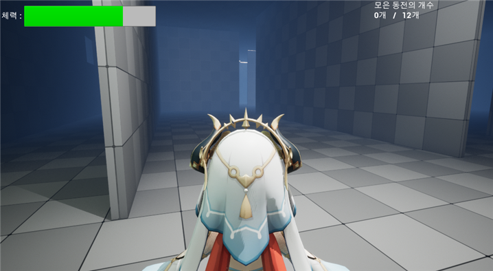
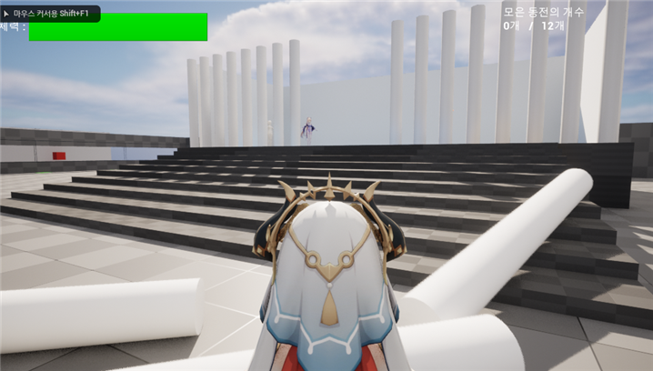
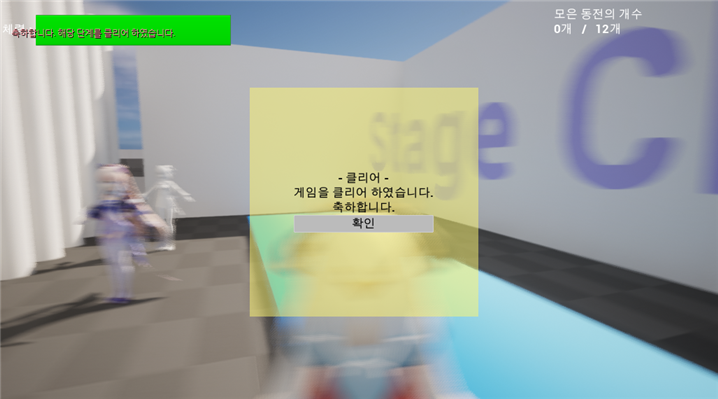
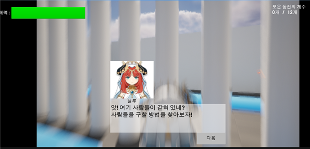

# UE5
I made a simple game with UE5.

4학년 2학기때 배운 언리얼엔진5로 간단한 게임을 만들었습니다.

  <h3>캐릭터 디자인</h3>
  <table>
    <tr>
      <td>
닐루
</td>
      <td>
코코미
</td>
    </tr>
    <tr>
      <td></img></td>
      <td></img></td>
    </tr>
  </table>

<a href="https://like-tea.tistory.com/m/337">캐릭터 모델링 참조 사이트</a>

<h3>스크린샷</h3>

  </img>

  </img>

  </img>

  </img>

  </img>

<h3></h3>

  <a href="https://github.com/kkt3343/UE5/raw/master/_reportAndImg/v1.wav">음성 다운로드</a>

  <a href="https://github.com/kkt3343/UE5/raw/master/_reportAndImg/v2.wav">음성 다운로드</a>

