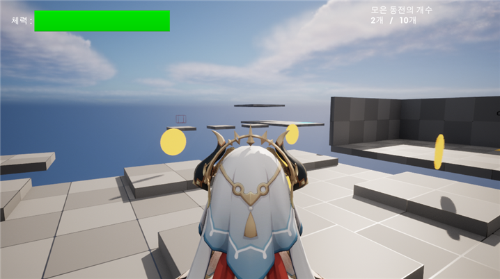

# UE5
I made a simple game with UE5.

4학년 2학기때 배운 언리얼엔진5로 간단한 게임을 만들었습니다.

  <h3>캐릭터 디자인</h3>
  <table>
    <tr>
      <td>
닐루
</td>
      <td>
코코미
</td>
    </tr>
    <tr>
      <td></img></td>
      <td></img></td>
    </tr>
  </table>

<h3>스크린샷</h3>

  </img>

  </img>

  </img>

  </img>

  </img>

